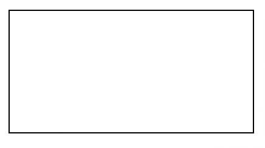

# Wheel Monitor



The Wheel Monitor is a TypeScript class that creates a visual representation of scroll activity for debugging purposes..

It provides an easy way to monitor and visualize scroll events on a webpage.

## Installation

You can install the Wheel Monitor using your preferred package manager:

```bash
yarn add -D wheel-monitor
```

or

```bash
npm install --save-dev wheel-monitor
```

## Usage

To use the Wheel Monitor, you need to import the `WheelMonitor` class and create an instance:

```ts
import { WheelMonitor } from 'wheel-monitor';

// Create an instance of WheelMonitor with custom settings
const monitor = new WheelMonitor({
  axis: 'y',
  height: 100,
  width: 200,
  color: '#0000cc',
  backgroundColor: '#fff',
});

// To destroy the monitor and remove event listeners and canvas
monitor.destroy();
```

## Manual mode

Ability to programmatically trigger a scroll event. For example, if you handle the scroll yourself.

```ts
import { WheelMonitor } from 'wheel-monitor';

const monitor = new WheelMonitor({
  manual: true,
});

window.addEventListener('wheel', (e) => {
  monitor.trigger(e.deltaX);
});
```

## Scale mode

You can enable scaling mode so that the values on the chart are scaled like on the demo.


```ts
import { WheelMonitor } from 'wheel-monitor';

const monitor = new WheelMonitor({
  scale: true,
});
```

## Overriding styles

You can add custom `className` with desired styles.

NOTE: If a custom `className` is specified, the default styles will not be applied.

Example:

```css
.wheel-monitor {
  position: absolute !important;
}
```

```ts
import { WheelMonitor } from 'wheel-monitor';

const monitor = new WheelMonitor({
  className: 'wheel-monitor',
});
```

## Options

The WheelMonitorSettings interface provides several options to customize the appearance and behavior of the monitor:

| Option      | Description        | Default Value |
| ----------- | ------------------ | ------------- |
| `manual`    | `manual` mode flag | false         |
| `scale`     | `scale` mode flag  | false         |
| `axis`      | Scroll axis        | `x` or `y`    |
| `height`    | Canvas height      | 100           |
| `width`     | Canvas width       | 200           |
| `zIndex`    | Canvas z-index     | 999999        |
| `barColor`  | Chart bar color    | `#0000cc`     |
| `className` | Custom `className` |               |

## License

This project is licensed under the MIT License - see the [LICENSE](./LICENSE) file for details.
